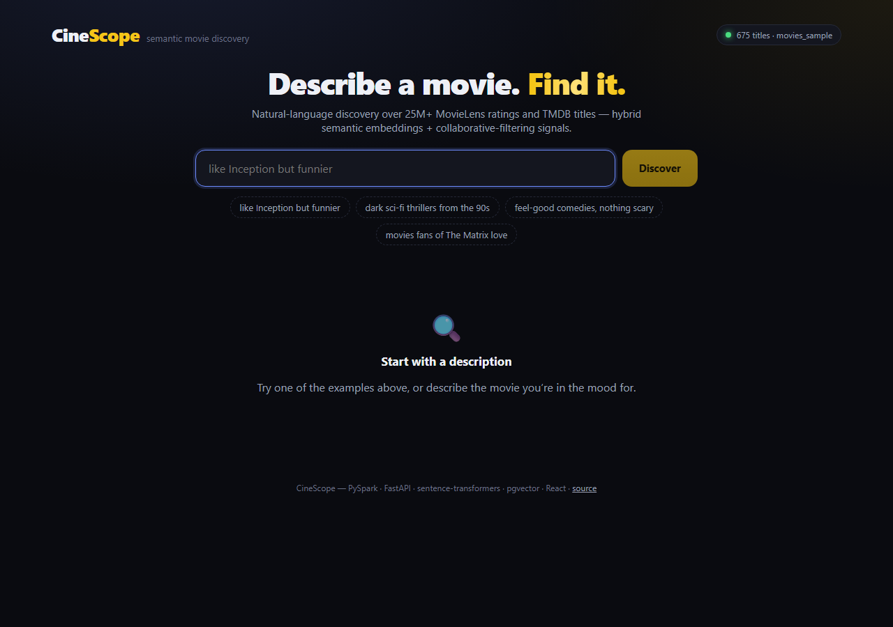
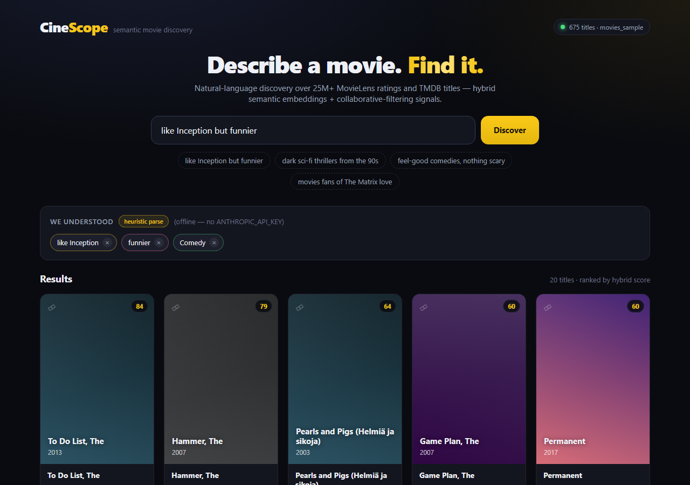
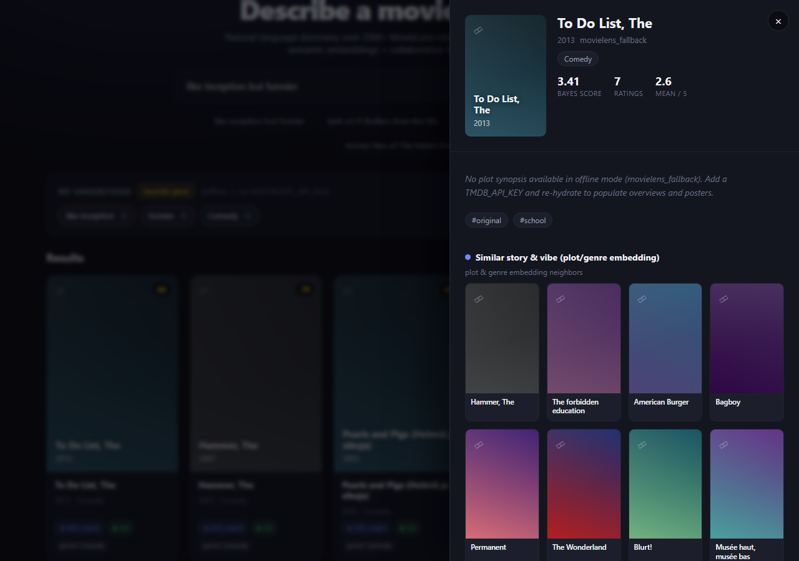

# CineScope — Semantic Movie Discovery Engine

Hybrid semantic + behavioral movie discovery over the MovieLens 25M dataset
(25M+ ratings) and the TMDB catalog (1M+ titles).

**Stack:** Python 3.11 / PySpark (offline pipeline) · PostgreSQL + pgvector ·
FastAPI · sentence-transformers · React (later milestones).

## Quickstart

Prereqs: [uv](https://docs.astral.sh/uv/), Docker, JDK 17
(and on Windows: Hadoop `winutils.exe` — paths are wired in `scripts/env.sh`).

```bash
# 1. Install Python deps
uv sync

# 2. Start Postgres (pgvector) on host port 5433
docker compose up -d

# 3. Set up env (keys optional — see .env.example; ingest needs NO keys)
cp .env.example .env

# 4. JVM env for Spark (required before any pipeline job)
source scripts/env.sh

# 5. Fast end-to-end check: 1% sample ingest (~2 min)
uv run pipeline ingest --sample

# 6. Full ingest: downloads ml-25m.zip (~262 MB, MD5-verified) + the TMDB
#    daily-export ID file, converts everything to partitioned Parquet, and
#    asserts >=25M ratings / >=1M TMDB titles.
uv run pipeline ingest
```

Both downloads are public — no API keys needed for ingest. `TMDB_API_KEY` and
`ANTHROPIC_API_KEY` are only used by later stages (metadata hydration, query
parsing) and those stages fall back to a labeled offline mode when unset.

## Pipeline jobs

Run as `uv run pipeline <job> [--sample]`. Every job is checkpointed and
resumable; `--sample` writes 1% data to `data/staging_sample/` so wiring can be
verified in minutes before full runs (which write to `data/staging/`).

| Job | Status | What it does |
| --- | --- | --- |
| `ingest` | ✅ M1 | MovieLens 25M CSVs + TMDB daily export → partitioned Parquet, row-count assertions |
| `cf` | ✅ M2 | Spark MLlib ALS → per-movie latent factors + behavioral stats (Bayesian-weighted score) |
| `hydrate` | ✅ M2 | TMDB detail fetcher (plots/posters), rate-limited + resumable; offline MovieLens fallback without a key |
| `embed` | ✅ M3 | sentence-transformers (all-MiniLM-L6-v2) over plot+genres+keywords → checkpointed parquet shards |
| `index` | ✅ M3 | Join factors + embeddings + metadata → Postgres table with `vector(384)` + `vector(64)` columns, HNSW cosine indexes on both |
| `eval` | ✅ M4 | Offline eval: per-user timestamp split (most recent 20% held out), precision/recall@{10,25} for embeddings-only / CF-only / hybrid rankers → `eval/results/<git-sha>.json` |
| `eval-gate` | ✅ M4 | Fails (non-zero exit) if hybrid precision@10 in the newest results regresses vs `eval/baseline.json` — wired into CI |

Jobs run in order: `ingest → cf → hydrate → embed → index → eval` (each checks its
upstream done-markers and tells you what to run first). `index --sample` loads
the `movies_sample` Postgres table so a full `movies` load is never clobbered
by a smoke test; the load is drop-and-recreate, so re-running is always safe.

Ingest chunking/resume: partial converts are skipped via done-markers under
`data/staging*/_done/`; you can also restrict work with
`uv run pipeline ingest --tables ratings genome_scores`.

## Offline eval + the ranking gate

No ranking change ships without offline scoring. The eval holds out each
user's most recent 20% of ratings (timestamp split, no leakage — ALS factors
and rating stats are retrained on the train split only) and scores three
rankers over the embedded catalog. The hybrid ranker uses the *same*
`pipeline/scoring.py` weighted combination the API serves.

```bash
source scripts/env.sh
uv run pipeline eval --sample        # writes eval/results/<git-sha>.json
uv run pipeline eval-gate            # non-zero exit on precision@10 regression
uv run pipeline eval-gate --update-baseline   # promote good results, commit both
```

`make eval-gate` wraps the gate. CI (GitHub Actions) runs ruff, pytest, and
the gate in **committed-results mode**: it compares the committed results JSON
against the committed baseline — no Spark or data in CI, so a ranking PR that
skipped the offline eval (or regressed) fails the build. The committed
baseline is generated in `--sample` mode (1% ratings, small catalog) and is
labeled as such inside the JSON; regenerate it after full runs.

## Serving API (FastAPI)

After `index --sample` (or a full `index`) has populated Postgres:

```bash
uv run uvicorn api.main:app --reload
```

The app auto-selects the serving table (`movies` if a full index exists, else
`movies_sample`; override with `CINESCOPE_TABLE` in `.env`).

### `POST /api/discover` — natural-language discovery

```bash
curl -s -X POST http://127.0.0.1:8000/api/discover \
  -H "Content-Type: application/json" \
  -d '{"query": "like Jaws but funnier", "limit": 5}'
```

1. **Parse** — Claude Haiku (`claude-haiku-4-5`, official `anthropic` SDK with
   structured outputs) turns the query into a validated spec:
   `{reference_titles, mood_adjustments, genres_include/exclude, year_range,
   min_rating, similarity_text}`. Without `ANTHROPIC_API_KEY` a deterministic
   heuristic parser (regex years/decades, genre keyword map with negation,
   "like &lt;title&gt;" extraction) serves the same interface — responses are
   labeled `"parser": "heuristic_fallback"`. Sending a pre-parsed `"spec"` in
   the body skips parsing entirely (this powers editable filter chips: chips
   re-query without re-parsing).
2. **Retrieve** — the spec's `similarity_text` is embedded with the *same*
   composer + model the index used, then one filtered pgvector HNSW scan
   (cosine) pulls a candidate pool; spec filters are fully parameterized SQL.
3. **Rank** — candidates are re-ranked by `pipeline/scoring.combine_hybrid`
   under `config.HYBRID_WEIGHTS` (semantic 0.45 / behavioral 0.40 / quality
   0.15) — the exact function and weights the offline eval gate scores. The
   behavioral signal is the mean ALS-factor cosine to the resolved
   `reference_titles` ("people who liked X").

Every result carries a `why` object: `semantic_similarity`,
`behavioral_boost` + `liked_by_fans_of`, `quality_score`, and
`matched_filters` (each entry is literally true for that movie — included
genres are conjunctive). The parsed `spec` and `parser` name are echoed in
the response for the UI.

### `GET /api/movies/{id}` — detail + more-like-this

Returns the movie plus **two labeled** neighbor lists: semantic (embedding
HNSW) and behavioral (ALS-factor HNSW). `GET /api/health` reports the table,
title count, and active parser. CORS is open to the Vite dev server
(`http://localhost:5173`).

## Frontend (React + Vite + TanStack Query)

A polished dark UI for natural-language discovery, in `web/`.

```bash
# In one terminal: the API (Postgres must be up + indexed)
uv run uvicorn api.main:app --reload

# In another: the frontend dev server (Vite proxies /api → :8000)
cd web
npm install
npm run dev            # http://localhost:5173
npm run build          # typecheck (tsc -b) + production bundle
```

The dev server proxies `/api/*` to the FastAPI backend (`vite.config.ts`;
override the target with `VITE_API_TARGET`), so there's no CORS friction and no
hardcoded API host. What it does:

- **Single natural-language search box** ("like Inception but funnier") →
  `POST /api/discover`.
- **Editable interpretation chips** — the parsed spec (reference titles, moods,
  genres include/exclude, year range, min rating) renders as chips. Removing a
  chip re-queries by POSTing the *modified spec* back in the `spec` field, so
  the backend **skips re-parsing** (`parser: "provided_spec"`). A subtle badge
  flags when the parse came from the heuristic fallback (no `ANTHROPIC_API_KEY`).
- **Results grid** — poster from the TMDB image CDN when `poster_path` exists,
  otherwise a styled deterministic gradient tile with title/year (fallback data
  has no posters — it still looks intentional). Each card shows the compact
  "why this matched" signals (semantic %, fans-of, quality ★, filters).
- **Detail drawer** — `GET /api/movies/{id}` with two labeled more-like-this
  rows: *Similar story & vibe* (embedding neighbors) and *Fans also loved*
  (ALS collaborative-filtering neighbors).
- Sensible loading (skeletons), empty, and error states throughout.

Screenshots live in [`docs/screenshots/`](docs/screenshots) and are
reproducible with `npm run screenshots` (Playwright, requires both servers
running).





## Layout

```
pipeline/        PySpark jobs + CLI (uv run pipeline <job>)
api/             FastAPI serving layer (discover + movie detail)
web/             React frontend (Vite + TanStack Query)
scripts/env.sh   JVM/Hadoop/venv env for Spark on Windows
docker-compose.yml  pgvector/pgvector:pg16 on host port 5433
data/            raw downloads + parquet staging (gitignored)
```

## Development

```bash
uv run pytest          # unit tests
uv run ruff check .    # lint
uv run ruff format .   # format
```
